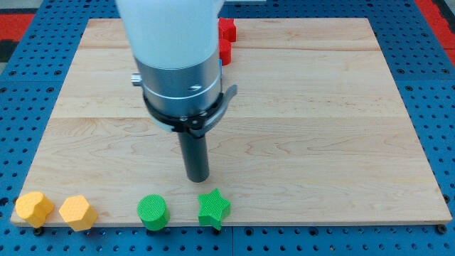
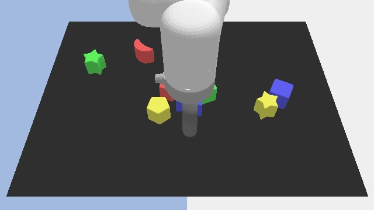

# Language Table

Language-Table is a suite of human-collected datasets and a multi-task continuous control benchmark for open vocabulary visuolinguomotor learning.

      |  
:-------------------------:|:-------------------------:|

## Installation

Installation with `pip`. `requirements.txt` contains dependencies for running
the environment and simple dataset examples.

```
python3 -m venv ./ltvenv
source ./ltvenv/bin/activate
pip install -r ./requirements.txt
export PYTHONPATH=${PWD}:$PYTHONPATH
```

For running the full train script, install using `requirements_static.txt`, as
this contains pinned versions for running the full train script.

```
python3 -m venv ./ltvenvtrain
source ./ltvenvtrain/bin/activate
pip install --no-deps -r ./requirements_static.txt
export PYTHONPATH=${PWD}:$PYTHONPATH
```
## Quickstart

### Examples
#### Scripts
Run and edit the following examples:

Load the environment and run 5 random steps:

```
python3 language_table/examples/environment_example.py
```

Load dataset and print first 5 elements:

```
python3 language_table/examples/dataset_example.py
```

#### Train

```
source ./ltvenvtrain/bin/activate
mkdir -p /tmp/language_table_train/
PROTOCOL_BUFFERS_PYTHON_IMPLEMENTATION=python  python language_table/train/main.py --config=./language_table/train/configs/language_table_sim_local.py --workdir=/tmp/language_table_train/
```

#### Colab
See the [colab](https://colab.research.google.com/github/google-research/language-table/blob/main/language_table/examples/language_table_tutorial.ipynb) for a more complete tutorial.

### Data
```
import tensorflow_datasets as tfds
data_directory = 'gs://gresearch/robotics/language_table/0.0.1/'
dataset = tfds.builder_from_directory(data_directory).as_dataset()
```

### Environment
```
from language_table.environments import blocks
from language_table.environments import language_table
from language_table.environments.rewards import block2block

env = language_table.LanguageTable(
  block_mode=blocks.LanguageTableBlockVariants.BLOCK_8,
  reward_factory=block2block.BlockToBlockReward,
  control_frequency=10.0,
)
obs = env.reset()
```

## Datasets

### Descriptions

* **Real Robot**
  * **language_table**: 442,226 episodes of real robot relabeled data.
* **Simulation (human)**
  * **language_table_sim**: 181,020 episodes of simulation relabeled data.
  * **language_table_blocktoblock_sim**: 8,000 episodes of single task "block to block" data.
  * **language_table_blocktoblock_4block_sim**: 8,298 episodes of single task "block to block" data in the 4 block configuration.
* **Simulation (oracle)**
  * **language_table_blocktoblock_oracle_sim**: 200,000 episodes of single task "block to block" data from an oracle scripted agent.
  * **language_table_blocktoblockrelative_oracle_sim**: 200,000 episodes of single task "block-to-block-relative" data from an oracle scripted agent.
  * **language_table_blocktoabsolute_oracle_sim**: 200,000 episodes of single task "block to absolute location" data from an oracle scripted agent.
  * **language_table_blocktorelative_oracle_sim**: 200,000 episodes of single task "block to relative location" data from an oracle scripted agent.
  * **language_table_separate_oracle_sim**: 200,000 episodes of single task "separate blocks" data from an oracle scripted agent.

### Summary Table

Dataset | Real/sim | Controlled by | Language-labeled by | # episodes
--------| --------- | ------------- | ----------------- | --------: 
language_table | real | human | human | 442,226
language_table_sim | sim | human | human | 181,020
language_table_blocktoblock_sim | sim | human | scripted | 8,000
language_table_blocktoblock_4block_sim |  sim | human | scripted | 8,298
language_table_blocktoblock_oracle_sim | sim | oracle | scripted | 200,000
language_table_blocktoblockrelative_oracle_sim | sim | oracle | scripted | 200,000
language_table_blocktoabsolute_oracle_sim | sim | oracle | scripted | 200,000
language_table_blocktorelative_oracle_sim | sim | oracle | scripted | 200,000
language_table_separate_oracle_sim | sim | oracle | scripted | 200,000

### Paths

Dataset | Data Location
--------| --------------
language_table | [gs://gresearch/robotics/language_table](https://console.cloud.google.com/storage/browser/gresearch/robotics/language_table/0.0.1/)
language_table_sim | [gs://gresearch/robotics/language_table_sim](https://console.cloud.google.com/storage/browser/gresearch/robotics/language_table_sim/0.0.1/)
language_table_blocktoblock_sim | [gs://gresearch/robotics/language_table_blocktoblock_sim](https://console.cloud.google.com/storage/browser/gresearch/robotics/language_table_blocktoblock_sim/0.0.1/)
language_table_blocktoblock_4block_sim | [gs://gresearch/robotics/language_table_blocktoblock_4block_sim](https://console.cloud.google.com/storage/browser/gresearch/robotics/language_table_blocktoblock_4block_sim/0.0.1/)
language_table_blocktoblock_oracle_sim | [gs://gresearch/robotics/language_table_blocktoblock_oracle_sim](https://console.cloud.google.com/storage/browser/gresearch/robotics/language_table_blocktoblock_oracle_sim/0.0.1/)
language_table_blocktoblockrelative_oracle_sim | [gs://gresearch/robotics/language_table_blocktoblockrelative_oracle_sim](https://console.cloud.google.com/storage/browser/gresearch/robotics/language_table_blocktoblockrelative_oracle_sim/0.0.1/)
language_table_blocktoabsolute_oracle_sim | [gs://gresearch/robotics/language_table_blocktoabsolute_oracle_sim](https://console.cloud.google.com/storage/browser/gresearch/robotics/language_table_blocktoabsolute_oracle_sim/0.0.1/)
language_table_blocktorelative_oracle_sim | [gs://gresearch/robotics/language_table_blocktorelative_oracle_sim](https://console.cloud.google.com/storage/browser/gresearch/robotics/language_table_blocktorelative_oracle_sim/0.0.1/)
language_table_separate_oracle_sim | [gs://gresearch/robotics/language_table_separate_oracle_sim](https://console.cloud.google.com/storage/browser/gresearch/robotics/language_table_separate_oracle_sim/0.0.1/)

## Checkpoints

Name | Config | Checkpoint Location
-----| -------| -------------------
BC+ResNet Sim| language_table/train/configs/language_table_resnet_sim_local.py | [gs://gresearch/robotics/language_table_checkpoints/bc_resnet_sim_checkpoint_955000](https://storage.googleapis.com/gresearch/robotics/language_table_checkpoints/bc_resnet_sim_checkpoint_955000)

## Interactive Language: Talking to Robots in Real Time
[Project Website](https://interactive-language.github.io/)&nbsp;&nbsp;•&nbsp;&nbsp;[PDF](https://arxiv.org/pdf/2210.06407.pdf)

*Corey Lynch, Ayzaan Wahid, Jonathan Tompson, Tianli Ding, James Betker, Robert Baruch, Travis Armstrong, Pete Florence*

**Abstract.** We present a framework for building interactive, real-time, natural language-instructable robots in the real world, and we open source related assets (dataset, environment, benchmark, and policies). Trained with behavioral cloning on a dataset of hundreds of thousands of language-annotated trajectories, a produced policy can proficiently execute an order of magnitude more commands than previous works: specifically we estimate a 93.5% success rate on a set of 87,000 unique natural language strings specifying raw end-to-end visuolinguo-motor skills in the real world. We find that the same policy is capable of being guided by a human via real-time language to address a wide range of precise long-horizon rearrangement goals, e.g. "make a smiley face out of blocks". The dataset we release comprises nearly 600,000 language-labeled trajectories, an order of magnitude larger than prior available datasets. We hope the demonstrated results and associated assets enable further advancement of helpful, capable, natural-language-interactable robots.

## Note

This is not an officially supported Google product.
